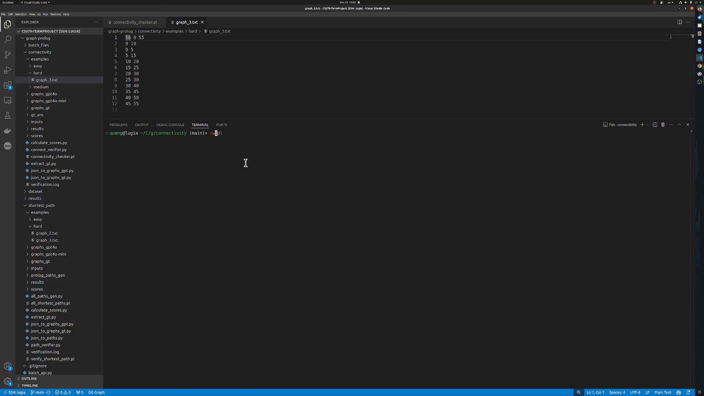
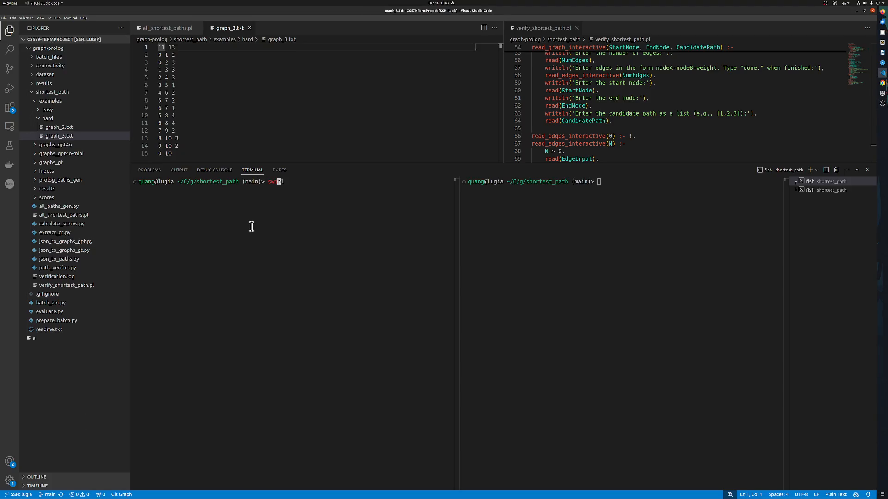

# LLM-SR Project

## Demo Videos & Results

Watch our demonstration videos:

### Graph Connectivity Solution

### Shortest Path Solution

### Project Structure

- **graph_gpt folder**: Input batch_input json file from inputs folder, extract and split to graph problems without answers using GPT

- **graph_gt folder**: Input gt json file from inputs folder, extract and split to graph problems without answers using string processing

- **gt_paths folder**: Input gt json file from inputs folder, extract and split to graph solutions using string processing 

- **inputs folder**: Graph problem json generated by gpt, graph solutions json generated by gpt and gt json.

- **prolog_path_gens folder**: Generate all possible paths from graph problems python, graph solutions using prolog from graph_gpt directory, graph solutions using prolog from graph_gt directory

### Prolog Verifier Role

Input/Output pairs:
1. Direct Path:
   - Input: gpt_shortest_path_direct
   - Output: direct_results

2. Indirect Path:
   - Input: gpt_shortest_path_indirect
   - Output: indirect_results

3. Ground Truth:
   - Input: ground_truth_paths
   - Output: gt_results

4. Prolog Path:
   - Input: prolog_shortest_path
   - Output: prolog_results